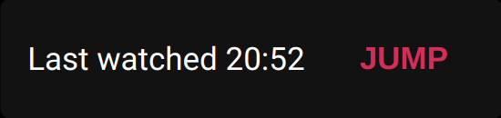
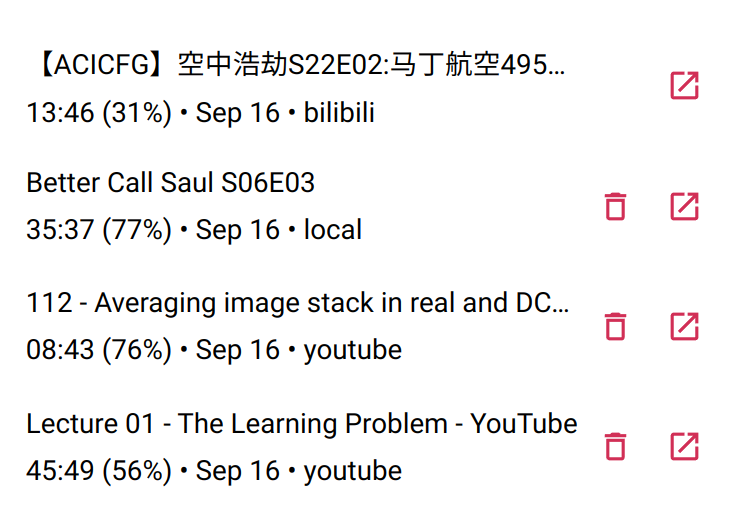
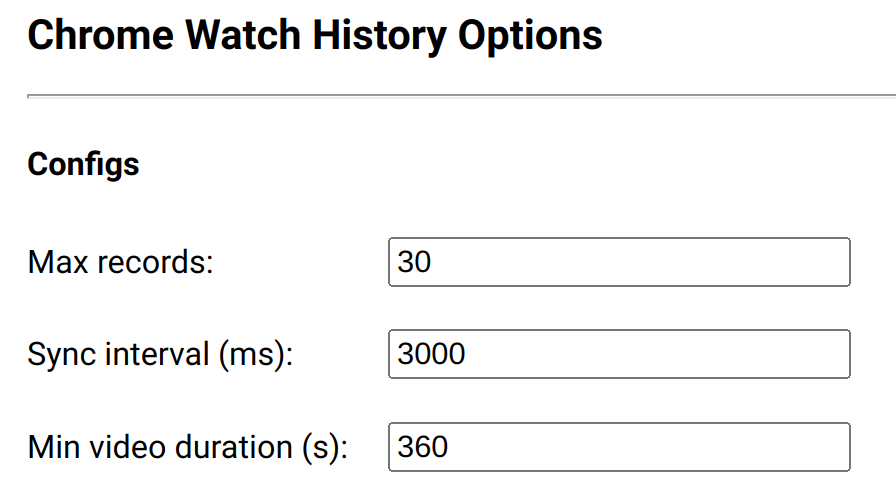

# chrome-watch-history


Keep track of your chrome video watching history, and jump to your last watch time.

## Functions

Snackbar will prompt if you watched the video before for you to skip the watched part.



You also have a list of watch history as popup.



You can config the options as well.



## Prerequisites

[node.js](https://nodejs.org/) and [yarn](https://yarnpkg.com/)

## Scripts

### Setup

```
yarn install
```

### Build

```
yarn build
```

### Dev

```
yarn dev
```
